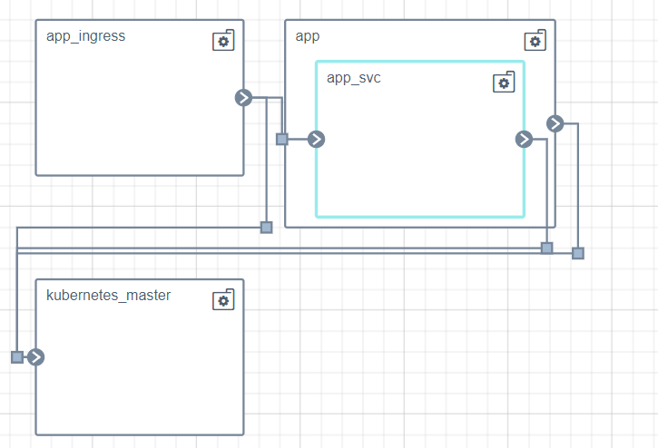

# OpenShift (Online) example

The blueprint shows a simple, unprivileged app service being deployed on OpenShift 4. The example was tested against Red Hat's OpenShift Online offering which has a managed control plane (ie. users have non-admin privileges, nor the ability to run most containers that require root privileges). 

The output of this blueprint deployment is a URL to the running service. 

## Authentication

See [Kubernetes plugin authentication](https://docs.cloudify.co/5.0.5/working_with/official_plugins/orchestration/kubernetes/#token-based-authentication) for how to get your authentication token. 

This blueprint requires the __kubernetes_endpoint__ and __kubernetes_token__ secrets be defined in your Cloudify Manager. 

## Service endpoint

This example uses a user-defined endpoint FQDN. If you are using OpenShift Online, you'll need to adjust __fqdn_suffix__ and __namespace__ inputs to match your environment. If you're using a different OpenShift, you may want to change the suffix entirely to match your desired domain. 

## Topology

